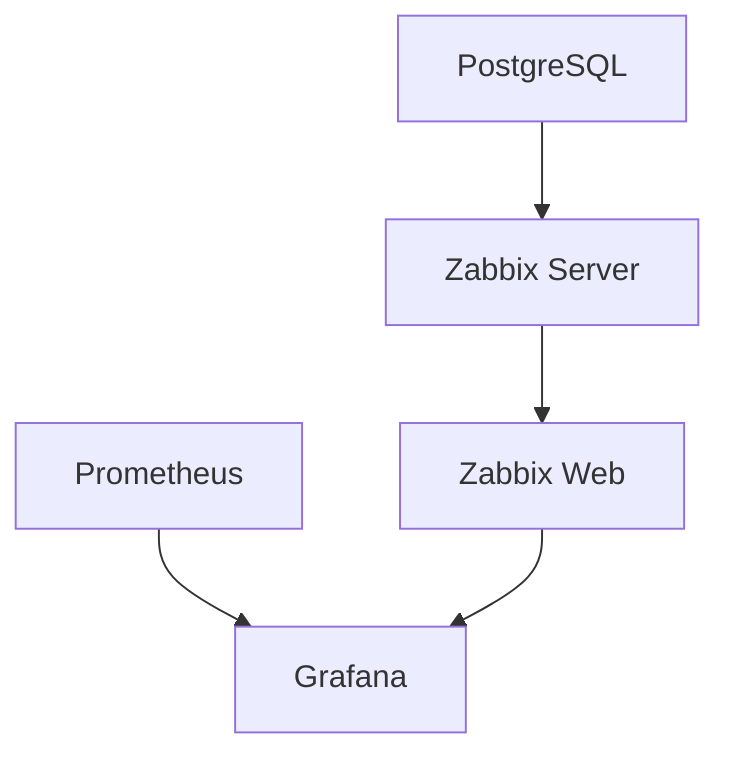

# 📂 .claude ディレクトリ説明書

このドキュメントは、`.claude`ディレクトリに含まれるすべてのファイルとスラッシュコマンドの目的・使い方を説明します。

---

## 📁 ディレクトリ構造

```
.claude/
├── SESSION_STATE.md           # セッション継続用ステータスファイル
├── QUICKSTART_SESSION.md      # クイックスタートガイド（セッション用）
├── settings.local.json        # Claude Code設定ファイル（ローカル）
└── commands/                  # スラッシュコマンド定義
    ├── init.md               # セッション開始時の自動実行
    ├── status.md             # 現在の作業状況確認
    ├── update-status.md      # 作業完了時の状態更新
    ├── project.md            # プロジェクト概要表示
    ├── check-config.md       # Terragrunt設定整合性チェック
    ├── debug.md              # デプロイ失敗時のトラブルシューティング
    ├── explore-deps.md       # サービス依存関係分析
    └── validate.md           # デプロイ前の事前検証
```

---

## 📄 主要ファイルの説明

### SESSION_STATE.md
**目的**: セッションをまたいで作業を継続するための状態管理ファイル

**内容**:
- ✅ 完了した作業の履歴
- 🚧 未完了のタスク（優先度別）
- 🐛 既知の問題・制約
- 📁 重要なファイルパス
- 🔧 よく使うコマンド
- 🎓 学習ポイント

**更新タイミング**:
- セッション開始時（自動で読み込み）
- 大きな作業完了時（`/update-status`で更新）
- 新しい問題発見時

**使い方**:
- Claude Codeは自動的にこのファイルを読み込みます
- `/status`で現在の状態を確認
- `/update-status`で状態を更新

---

### settings.local.json
**目的**: Claude Code のローカル設定（Gitにコミットされない）

**設定内容**:
- エディタの振る舞い
- 実行ポリシー
- プロジェクト固有の設定

**注意**: このファイルは`.gitignore`に含まれており、個人設定として扱われます

---

## 🔧 スラッシュコマンド一覧

スラッシュコマンドは `/コマンド名` の形式で実行します。
例: `/status` → Enter

### セッション管理コマンド

#### `/init` - セッション開始時の自動実行
**説明**: 新しいセッション開始時にプロジェクト情報を自動表示

**実行内容**:
1. `.claude/SESSION_STATE.md` を読み込み
2. 前回セッションの作業内容を要約表示
3. 未完了のタスクと次のステップを表示
4. 現在の状態に基づいた推奨アクションを提示
5. 利用可能なスラッシュコマンド一覧

**実行タイミング**: セッション開始時（自動）

**手動実行**: 不要（自動実行されます）

---

#### `/status` - 現在の作業状況確認
**説明**: 現在の作業状況と次のステップを確認

**実行内容**:
1. 完了した作業リスト
2. 未完了のタスク（優先度別）
3. 現在のブロッカー（進行を妨げている問題）
4. 推奨アクション（次に実行すべきこと）

**実行タイミング**:
- 作業の途中で進捗を確認したいとき
- 次に何をすべきか迷ったとき
- 長時間作業した後で状況を整理したいとき

**使用例**:
```
ユーザー: /status
Claude: SESSION_STATE.mdを確認します...

【完了した作業】
✅ Terragrunt初期化完了
✅ SSH接続設定完了

【未完了のタスク】
🚧 優先度: 高
- Terragruntデプロイ (apply待ち)

【推奨アクション】
次は `terragrunt run --all apply` を実行してデプロイを完了させましょう。
```

---

#### `/update-status` - 作業完了時の状態更新
**説明**: 作業完了時にSESSION_STATE.mdを更新

**実行内容**:
1. タイムスタンプ更新
2. 完了した作業を「✅ 完了した作業」セクションに追加
3. 新たな問題を「🐛 既知の問題」に追加
4. 次のステップを「🚧 未完了」に反映

**実行タイミング**:
- 大きな作業（機能実装、設定変更等）を完了したとき
- 新しい問題を発見したとき
- セッションを終了する前

**使用例**:
```
ユーザー: Terragruntのデプロイが完了しました。/update-status
Claude: SESSION_STATE.mdを更新します...
✅ 更新完了しました。次回セッションでこの情報が引き継がれます。
```

---

### プロジェクト情報コマンド

#### `/project` - プロジェクト概要表示
**説明**: プロジェクト概要とアーキテクチャを表示

**実行内容**:
1. プロジェクトの目的と構成
2. 主要なコンポーネント（サービス一覧）
3. ディレクトリ構成
4. クイックスタート手順
5. 現在の開発フェーズ

**実行タイミング**:
- プロジェクト全体を把握したいとき
- 新しいメンバーへの説明時
- アーキテクチャを確認したいとき

**使用例**:
```
ユーザー: /project
Claude: このプロジェクトの概要を表示します...

【目的】
Terraform + Terragrunt + Vaultを使用した学習用監視基盤の構築

【構成】
- Zabbix (監視)
- Prometheus (メトリクス)
- Grafana (可視化)
...
```

---

### 診断・検証コマンド

#### `/validate` - デプロイ前の事前検証
**説明**: デプロイ前の環境検証を実行

**実行内容**:
1. `.env` ファイルの存在確認
2. Docker Engine が起動しているか確認
3. 必要なポートが空いているか確認 (8080, 9090, 3000, 8200, 5432)
4. 開発コンテナの起動状態確認
5. ディスク容量の確認

**実行タイミング**:
- `terragrunt apply` を実行する前
- エラーが発生しそうな予感がするとき
- 環境をクリーンアップした後

**使用例**:
```
ユーザー: デプロイ前に環境を確認したいです。/validate
Claude: デプロイ前の検証を開始します...

【検証項目】
✅ .env ファイル: 存在します
✅ Docker Engine: 起動中
⚠️  ポート8080: 使用中です
❌ ディスク容量: 不足しています (500MB必要)

【推奨アクション】
1. ポート8080を解放してください
2. ディスク容量を確保してください
```

---

#### `/check-config` - Terragrunt設定整合性チェック
**説明**: Terragrunt設定ファイルの整合性をチェック

**使用エージェント**: Explore (medium thoroughness)

**実行内容**:
1. すべての terragrunt.hcl ファイルを読み込み
2. 依存関係の定義漏れチェック
3. 環境変数の定義確認
4. Docker イメージ名・バージョンの一貫性確認
5. ポート番号の重複チェック

**実行タイミング**:
- terragrunt.hcl を編集した後
- エラーが頻発するとき
- 設定ファイルの整合性に不安があるとき

**使用例**:
```
ユーザー: /check-config
Claude: Terragrunt設定の整合性をチェックします...

【チェック結果】
✅ 依存関係: 正常
⚠️  ポート番号: postgres と vault で 5432 が重複
❌ イメージバージョン: grafana のバージョン指定なし

【修正提案】
1. vault のポートを 8200 に変更
2. grafana のイメージを `grafana/grafana:10.2.0` に指定
```

---

#### `/debug` - デプロイ失敗時のトラブルシューティング
**説明**: デプロイ失敗時のトラブルシューティング

**使用エージェント**: general-purpose

**実行内容**:
1. Terragrunt State ファイルの確認
2. Docker コンテナのログ確認
3. ネットワーク設定の検証
4. ボリュームの状態確認
5. エラーログの解析

**実行タイミング**:
- `terragrunt apply` が失敗したとき
- コンテナが起動しないとき
- ネットワーク接続に問題があるとき

**使用例**:
```
ユーザー: デプロイが失敗しました。/debug
Claude: トラブルシューティングを開始します...

【問題の検出】
❌ PostgreSQLコンテナが起動していません

【原因】
- ポート5432が既に使用されています
- ログ: "Error starting userland proxy: listen tcp4 0.0.0.0:5432: bind: address already in use"

【修正手順】
1. 既存のPostgreSQLを停止: `docker stop postgres`
2. 再度デプロイ: `terragrunt apply`
```

---

#### `/explore-deps` - サービス依存関係分析
**説明**: サービス間の依存関係を分析してグラフ化

**使用エージェント**: Explore (very thorough)

**実行内容**:
1. terraform/envs/local 配下のすべての terragrunt.hcl を読み込み
2. `dependency` ブロックを抽出
3. `depends_on` や環境変数での参照を確認
4. 起動順序の妥当性をチェック

**出力形式**:
- Mermaid形式の依存関係図
- 循環依存の有無
- 推奨される起動順序

**実行タイミング**:
- サービス間の依存関係を理解したいとき
- 起動順序の問題をデバッグするとき
- ドキュメント作成時

**使用例**:
```
ユーザー: /explore-deps
Claude: サービス依存関係を分析します...

【依存関係グラフ】


【推奨起動順序】
1. postgres, vault, prometheus (並列可)
2. zabbix_server
3. zabbix_web
4. grafana

【循環依存】
✅ なし
```

---

## 🎯 コマンドの使い分け

### 状況別おすすめコマンド

**セッション開始時**:
- `/init` (自動実行)
- `/status` (状況確認)

**作業前**:
- `/validate` (環境検証)
- `/check-config` (設定確認)

**作業中**:
- `/status` (進捗確認)
- `/project` (仕様確認)

**エラー発生時**:
- `/debug` (原因調査)
- `/check-config` (設定確認)
- `/explore-deps` (依存関係確認)

**作業完了時**:
- `/update-status` (状態更新)

---

## 🔄 エージェントについて

一部のスラッシュコマンドは**エージェント**（自律的なサブタスク実行機能）を使用します。

### 使用されるエージェント

#### Explore エージェント
- **用途**: コードベースの探索と分析
- **使用コマンド**: `/check-config`, `/explore-deps`
- **thoroughness level**:
  - `medium`: 通常の探索
  - `very thorough`: 徹底的な探索

#### general-purpose エージェント
- **用途**: 複雑な多段階タスクの実行
- **使用コマンド**: `/debug`, `/validate`
- **特徴**: コマンド実行、ファイル読み取り、分析を自律的に実行

---

## 📝 カスタムコマンドの追加

新しいスラッシュコマンドを追加したい場合:

1. `.claude/commands/` に新しい `.md` ファイルを作成
2. 以下のフォーマットで記述:

```markdown
---
description: コマンドの簡潔な説明
---

実行してほしいタスクの詳細をここに記述
```

3. Claude Code を再起動すると自動的に認識されます

**例**: `/backup` コマンドを追加

```markdown
---
description: 設定ファイルのバックアップを作成
---

以下のファイルを `.backup/` ディレクトリにコピーしてください:
1. terraform/envs/local/**/*.hcl
2. docker-compose.yml
3. .env

タイムスタンプ付きのディレクトリ名で保存してください。
```

---

## ⚠️ 注意事項

### スラッシュコマンドの制限
- コマンドは非対話的に実行されます
- ユーザーへの確認プロンプトは表示できません
- 長時間実行するタスクは適していません

### エージェント使用時の注意
- エージェントは自律的にタスクを実行します
- 予期しないコマンドが実行される可能性があります
- 重要なファイルを変更する前に確認してください

### SESSION_STATE.md の管理
- 手動で編集可能ですが、フォーマットを崩さないように注意
- 大きくなりすぎた場合は古い履歴をアーカイブ
- Gitにコミットして履歴を追跡可能

---

## 🔗 関連ドキュメント

- `CLAUDE.md`: プロジェクト概要とコミュニケーションガイドライン
- `SESSION_STATE.md`: 現在の作業状態
- `.env.example`: 環境変数のテンプレート
- `README.md`: プロジェクト全体のドキュメント

---

**最終更新**: 2025-10-19
