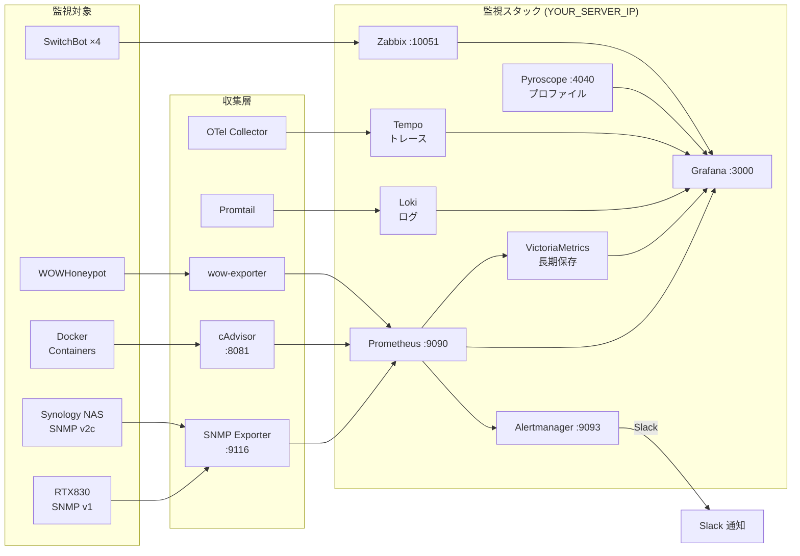

# 🔬 Monitoring Lab - 自宅オブザーバビリティ基盤

Terraform + Terragrunt + Vault を使用した、学習用の監視基盤IaC構成です。
リモートDockerサーバー（YOUR_SERVER_IP）上に監視スタック一式をデプロイします。

---

## 📐 アーキテクチャ構成図

> `docs/` 以下の `.drawio` ファイルを draw.io（[app.diagrams.net](https://app.diagrams.net) または VS Code の Draw.io 拡張機能）で開いてください。

| ファイル | 内容 |
|---------|------|
| `docs/network-topology.drawio` | **ネットワークトポロジー** — 物理構成・LAN/WAN・クラウド接続 |
| `docs/monitoring-stack.drawio` | **監視スタック** — コンポーネント間のデータフロー・ポート番号 |
| [`docs/mcp-servers.md`](docs/mcp-servers.md) | **MCP Servers** — Claude Code 連携の使い方・ツールリファレンス |

**概要（LGTM スタック + Zabbix + 長期保存 + プロファイリング）:**



---

## 📦 構成要素

### 監視基盤サービス（リモートサーバー: YOUR_SERVER_IP）

| コンポーネント | イメージ | ポート | 用途 |
|-------------|---------|------|------|
| **PostgreSQL** | `postgres:15-alpine` | 5432 | Zabbix データ永続化 |
| **Vault** | `hashicorp/vault:latest` | 8200 | 機密情報管理（**本番モード**: file storage + 自己署名TLS + 永続化） |
| **Zabbix Server** | `zabbix/zabbix-server-pgsql` | 10051 | 監視サーバー |
| **Zabbix Agent2** | `zabbix/zabbix-agent2` | 10050 | Zabbix Server 自己監視 |
| **Zabbix Web** | `zabbix/zabbix-web-apache-pgsql` | 8080 | Web UI |
| **Prometheus** | `prom/prometheus:latest` | 9090 | 時系列メトリクス収集 + アラート |
| **cAdvisor** | `gcr.io/cadvisor/cadvisor` | 8081 | Docker コンテナメトリクス収集 |
| **SNMP Exporter** | `prom/snmp-exporter` | 9116 | 物理機器 SNMP → Prometheus 変換 |
| **Grafana** | `grafana/grafana:latest` | 3000 | 可視化ダッシュボード |
| **New Relic Infra** | `newrelic/infrastructure:latest` | - | 統合監視プラットフォーム連携 |
| **Alertmanager** | `prom/alertmanager` | 9093 | アラート通知ルーティング（Slack） |
| **Loki** | `grafana/loki` | 3100 | ログ集約 |
| **Promtail** | `grafana/promtail` | - | ログ収集エージェント |
| **Tempo** | `grafana/tempo:2.6.1` | - | 分散トレーシング |
| **OTel Collector** | `otel/opentelemetry-collector:0.148.0` | - | テレメトリ収集パイプライン |
| **VictoriaMetrics** | `victoriametrics/victoria-metrics` | 8428 | 長期メトリクス保存 |
| **Pyroscope** | `grafana/pyroscope:2.0.2` | 4040 | 継続的プロファイリング（LGTM の "P"） |
| **wow-exporter** | （カスタム Python） | - | WOWHoneypot ログ → Prometheus 変換 |
| **GitHub Runner** | `myoung34/github-runner` | - | CI/CD セルフホストランナー |

> **Workspace 数**: 20（HCP Terraform でサービスごとに分離管理）

### 監視対象

| 対象 | 監視方法 | 監視項目 |
|------|---------|---------|
| **SwitchBot 温湿度計 × 4** | Zabbix External Check (SwitchBot API) | 温度、湿度、バッテリー、照度、人感 |
| **Yamaha RTX830** (YOUR_ROUTER_IP) | SNMP Exporter → Prometheus (SNMP v1) | インターフェーストラフィック、リンク状態 |
| **Synology NAS** (YOUR_NAS_IP) | SNMP Exporter → Prometheus (SNMP v2c) | CPU、ストレージ、ネットワーク、Uptime |
| **Docker コンテナ** | cAdvisor → Prometheus | CPU、メモリ、ネットワーク、ホストメトリクス |
| **ホスト OS** | New Relic Infrastructure Agent | CPU、メモリ、ディスク、ネットワーク |

### Grafana ダッシュボード

| ダッシュボード | データソース | 内容 |
|-------------|------------|------|
| **cAdvisor** | Prometheus | Docker コンテナ CPU / メモリ / ネットワーク |
| **Physical Devices** | Prometheus | RTX830 / Synology NAS のメトリクス |
| **Integrated Monitoring** | Prometheus + Zabbix | スクレイプ状態、アラート数、SwitchBot 温湿度 |

### アラートルール（Prometheus）

| ルール | 条件 |
|--------|------|
| `TargetDown` | スクレイプターゲットが応答なし |
| `ContainerHighCPU` | コンテナ CPU 使用率 > 80% (5分継続) |
| `ContainerHighMemory` | コンテナメモリ使用率 > 85% (5分継続) |
| `RTX830LANInterfaceDown` | LAN インターフェースがダウン (2分継続) |
| `SynologyHighCPU` | NAS CPU > 80% (5分継続) |
| `SynologyDiskHighUsage` | Volume 使用率 > 85% (10分継続) |

### MCP Servers（Claude Code 連携）

AI を活用した自律的インフラ運用基盤。詳細は [`docs/mcp-servers.md`](docs/mcp-servers.md) を参照。

| MCP Server | ツール数 | 主な機能 |
|-----------|---------|---------|
| **docker-server** | 6 | コンテナ一覧・ログ・起動/停止/再起動・stats |
| **prometheus-server** | 6 | PromQL クエリ・アラート確認・AI 改善提案生成 |
| **terragrunt-server** | 6 | plan/apply・承認フロー・ロールバック |
| **alertmanager-server** | 4 | アクティブアラート確認・サイレンス作成/一覧/削除 |

---

## 🎯 このプロジェクトの目的

- **IaC の学習**: Terraform / Terragrunt の実践的な理解
- **Vault 連携**: 本番モード（file storage + 自己署名TLS + 永続化）で稼働、シークレット管理を実践
- **監視基盤の構築**: Zabbix + Prometheus + Grafana の統合環境構築
- **MCP Server 開発**: AI を活用した自律的インフラ改善基盤（Docker / Prometheus / Terragrunt MCP 稼働中）

---

## 📁 ディレクトリ構成

```
monitoring-lab-terraform/
├── docs/
│   ├── network-topology.drawio     # ネットワークトポロジー図（物理構成・LAN/WAN）
│   └── monitoring-stack.drawio     # 監視スタック構成図（コンポーネント・データフロー）
├── config/
│   ├── prometheus/
│   │   ├── prometheus.yml          # スクレイプ設定（SNMP / cAdvisor / Prometheus self）
│   │   └── alerts.yml              # アラートルール
│   ├── snmp/
│   │   └── snmp.yml                # SNMP Exporter 設定（RTX830 / Synology）
│   ├── alertmanager/
│   │   └── alertmanager.yml        # Alertmanager Slack 通知設定
│   ├── grafana/
│   │   └── provisioning/
│   │       ├── datasources/
│   │       │   └── datasources.yml # Prometheus + Zabbix データソース定義
│   │       └── dashboards/
│   │           ├── dashboards.yml
│   │           └── *.json          # 各種ダッシュボード
│   ├── loki/                       # Loki ログ集約設定
│   ├── promtail/                   # Promtail ログ収集設定
│   ├── tempo/                      # Tempo 分散トレーシング設定
│   ├── otel-collector/             # OpenTelemetry Collector 設定
│   └── sloth/                      # Sloth SLO 定義
├── terraform/
│   ├── root.hcl                     # ルート設定（HCP Terraform backend、Docker Provider）
│   ├── modules/
│   │   ├── docker_container/        # 共通 Docker コンテナモジュール
│   │   ├── network/                 # Docker ネットワークモジュール
│   │   └── vault_secret/            # Vault シークレット管理モジュール
│   └── envs/
│       └── local/
│           ├── terragrunt.hcl       # 環境固有設定
│           ├── network/             # Docker ネットワーク
│           ├── postgres/            # PostgreSQL
│           ├── vault/               # Vault（本番モード: file storage + TLS）
│           ├── vault-secrets/       # Vault シークレット管理
│           ├── zabbix/              # Zabbix Server / Web
│           ├── zabbix-agent/        # Zabbix Agent2
│           ├── prometheus/          # Prometheus + Alert Rules + SLO Rules
│           ├── alertmanager/        # Alertmanager
│           ├── cadvisor/            # cAdvisor（コンテナメトリクス）
│           ├── snmp-exporter/       # SNMP Exporter（物理機器監視）
│           ├── grafana/             # Grafana
│           ├── loki/                # Loki（ログ集約）
│           ├── promtail/            # Promtail（ログ収集）
│           ├── tempo/               # Tempo（分散トレーシング）
│           ├── otel-collector/      # OpenTelemetry Collector
│           ├── victoria-metrics/    # VictoriaMetrics（長期メトリクス保存）
│           ├── github-runner/       # GitHub Actions Self-hosted Runner
│           └── newrelic/            # New Relic Infrastructure
├── scripts/
│   ├── setup-remote-config.sh      # リモートサーバー初期設定
│   └── sync-config.sh              # 設定ファイル同期スクリプト
├── mcp/
│   ├── prometheus-server/          # Prometheus MCP Server
│   ├── docker-server/              # Docker MCP Server
│   ├── terragrunt-server/          # Terragrunt MCP Server
│   └── alertmanager-server/        # Alertmanager MCP Server
├── specs/                          # Speckit ADLC 仕様書・設計ドキュメント
├── .github/
│   └── workflows/                  # GitHub Actions CI/CD ワークフロー
├── .claude/
│   └── commands/                   # Claude Code スラッシュコマンド
├── Taskfile.yml                     # タスクランナー（go-task）
├── docker-compose.yml               # 開発環境（Terragrunt / Vault）
├── .env.example                     # 環境変数テンプレート
└── README.md                        # このファイル
```

---

## 🚀 クイックスタート

### 前提条件

| 要件 | 詳細 |
|------|------|
| **WSL2** | Ubuntu-24.04（Docker Engine 29.x がインストール済み） |
| **Docker Engine** | WSL2 上で動作（Docker Desktop ではない） |
| **SSH 鍵** | `~/.ssh/id_rsa`（WSL2 内、リモートサーバー YOUR_SERVER_IP に接続可能） |
| **HCP Terraform トークン** | `.env` に `TF_TOKEN_app_terraform_io` として設定 |

> ⚠️ このプロジェクトは **WSL2 上の Docker Engine** を使用します。Docker Desktop は使用しません。

### 初回セットアップ

```bash
# 1. WSL2 の Docker を起動
wsl -d Ubuntu-24.04 -e bash -c "sudo service docker start"

# 2. 環境変数ファイルを作成
cp .env.example .env
# .env を編集して TF_TOKEN_app_terraform_io などを設定

# 3. 開発コンテナを起動（WSL2 経由）
wsl -d Ubuntu-24.04 -e bash -c "cd /path/to/monitoring-lab-terraform && docker compose up -d"

# 4. Terragrunt コンテナに接続
wsl -d Ubuntu-24.04 -e bash -c "docker exec -it monitoring-lab-terragrunt sh"

# コンテナ内で実行:
cd /workspace/terraform/envs/local
terragrunt run --all init
terragrunt run --all plan
terragrunt run --all apply
```

### アクセス URL

| サービス | URL | 認証情報 |
|---------|-----|---------|
| **Grafana** | `http://YOUR_SERVER_IP:3000` | admin / admin |
| **Zabbix Web** | `http://YOUR_SERVER_IP:8080` | Admin / zabbix |
| **Prometheus** | `http://YOUR_SERVER_IP:9090` | 認証なし |
| **cAdvisor** | `http://YOUR_SERVER_IP:8081` | 認証なし |
| **SNMP Exporter** | `http://YOUR_SERVER_IP:9116` | 認証なし |
| **Vault** | `https://YOUR_SERVER_IP:8200` | Token: 本番 root（`.env`）／自己署名TLS（再起動後は unseal 必要） |
| **New Relic** | `https://one.newrelic.com/` | ライセンスキーで認証 |
| **HCP Terraform** | `https://app.terraform.io/app/YOUR_TF_ORG` | API Token |

---

## 🔧 個別サービスの操作

### 特定サービスのみ更新

```bash
# コンテナ内で実行
cd /workspace/terraform/envs/local/grafana
terragrunt apply

cd /workspace/terraform/envs/local/prometheus
terragrunt apply
```

### Prometheus 設定のホットリロード

```bash
wsl -d Ubuntu-24.04 -e bash -c \
  "ssh ubuntu@YOUR_SERVER_IP 'curl -s -X POST http://localhost:9090/-/reload'"
```

### リモートサーバーのコンテナ確認

```bash
wsl -d Ubuntu-24.04 -e bash -c "ssh ubuntu@YOUR_SERVER_IP 'docker ps'"
```

---

## 🗑️ 環境の削除

```bash
# コンテナ内で実行
cd /workspace/terraform/envs/local
TG_NON_INTERACTIVE=true terragrunt run --all destroy

# 削除順序（依存関係の逆順）
# grafana → cadvisor → snmp-exporter → prometheus → zabbix-agent → zabbix → vault → postgres → network
```

> ⚠️ Docker ボリュームも削除されるため、Zabbix / Grafana のデータは完全に消失します。

---

## 📚 学習ポイント

### 1. Terragrunt の利点

#### DRY 原則の実践

共通設定（Docker Provider、HCP Terraform backend）を `root.hcl` に集約し、各サービスは差分のみ定義。

#### 依存関係の自動解決

```hcl
dependency "postgres" {
  config_path = "../postgres"
}
```
→ Zabbix は PostgreSQL の起動を自動的に待機してからデプロイされる。

#### 一括操作

```bash
terragrunt run --all apply   # 全サービスを正しい順序でデプロイ
terragrunt run --all destroy # 依存関係を考慮して削除
```

### 2. HCP Terraform によるState管理

ローカルの `terraform.tfstate` ではなく、[HCP Terraform](https://app.terraform.io) の Remote Backend を使用。

- **Organization**: `YOUR_TF_ORG`
- **Workspace 数**: 20（サービスごとに分離）
- **Execution Mode**: Local（Terraform 実行はコンテナ内で行い、State のみ HCP 管理）

```hcl
# root.hcl
remote_state {
  backend = "cloud"
  config = {
    organization = "YOUR_TF_ORG"
    workspaces {
      name = "${local.project_name}-${local.environment}-${path_relative_to_include()}"
    }
  }
}
```

### 3. Vault との連携（本番モード稼働中）

Vault は本番モード（file storage + 自己署名TLS + 永続化）で稼働し、3シークレット（postgres / grafana / alertmanager）を格納済み。再起動後は unseal 鍵による開封が必要。サービス側の動的取得は今後実装予定:

```hcl
data "vault_kv_secret_v2" "postgres" {
  mount = "secret"
  name  = "monitoring-lab/postgres"
}

env = [
  "POSTGRES_PASSWORD=${data.vault_kv_secret_v2.postgres.data["password"]}"
]
```

### 4. Pull 型 vs Push 型監視の使い分け

| 方式 | ツール | 用途 |
|------|--------|------|
| **Pull 型** | Prometheus | Docker コンテナ、物理機器（SNMP Exporter 経由） |
| **Push 型** | Zabbix | SwitchBot 温湿度計（External Check API 呼び出し） |
| **エージェント型** | New Relic Infra | ホスト OS / コンテナ統合監視 |

### 5. SNMP Exporter の活用

ルーターや NAS などの SNMP 対応機器を Prometheus で監視する変換レイヤー。

```yaml
# prometheus.yml
- job_name: 'snmp_rtx830'
  static_configs:
    - targets: ['YOUR_ROUTER_IP']
  metrics_path: /snmp
  params:
    module: [if_mib]
    auth: [monlab_v1]    # v0.30.1以降: URLパラメータで認証指定
  relabel_configs:
    - source_labels: [__address__]
      target_label: __param_target
    - target_label: __address__
      replacement: localhost:9116
```

---

## 🛠️ トラブルシューティング

### WSL2 の Docker が停止している

```bash
wsl -d Ubuntu-24.04 -e bash -c "sudo service docker start"
```

### Terragrunt コンテナが起動しない（Vault 依存）

```bash
# Vault を先に起動してから Terragrunt を起動
wsl -d Ubuntu-24.04 -e bash -c "cd /path/to/monitoring-lab-terraform && docker compose up -d vault"
wsl -d Ubuntu-24.04 -e bash -c "cd /path/to/monitoring-lab-terraform && docker compose up -d terragrunt"

# または one-shot で実行（Vault 依存を回避）
wsl -d Ubuntu-24.04 -e bash -c "docker compose run --rm terragrunt sh -c \
  'cd /workspace/terraform/envs/local/<service> && terragrunt apply -auto-approve'"
```

### HCP Terraform の新規 Workspace が Remote モードになる

新規 Workspace はデフォルトで Remote 実行モードになります。Local モードへの変更が必要です:

```bash
curl -X PATCH "https://app.terraform.io/api/v2/organizations/YOUR_TF_ORG/workspaces/<workspace-name>" \
  -H "Authorization: Bearer $TF_TOKEN_app_terraform_io" \
  -H "Content-Type: application/vnd.api+json" \
  --data '{"data":{"type":"workspaces","attributes":{"execution-mode":"local"}}}'
```

### Prometheus がデータを収集しない

```bash
# ターゲット状態確認
# ブラウザ: http://YOUR_SERVER_IP:9090/targets

# 設定リロード
wsl -d Ubuntu-24.04 -e bash -c \
  "ssh ubuntu@YOUR_SERVER_IP 'curl -s -X POST http://localhost:9090/-/reload'"
```

### SNMP Exporter がターゲットを取得できない

```bash
# RTX830 疎通確認
wsl -d Ubuntu-24.04 -e bash -c \
  "ssh ubuntu@YOUR_SERVER_IP 'snmpwalk -v1 -c monlab YOUR_ROUTER_IP sysDescr.0'"

# Synology 疎通確認
wsl -d Ubuntu-24.04 -e bash -c \
  "ssh ubuntu@YOUR_SERVER_IP 'snmpwalk -v2c -c monlab YOUR_NAS_IP sysDescr.0'"
```

> ⚠️ RTX830 は SNMP **v1 のみ**対応（v2c はタイムアウト）。

### コンテナが起動しない（リモートサーバー）

```bash
# ログ確認
wsl -d Ubuntu-24.04 -e bash -c \
  "ssh ubuntu@YOUR_SERVER_IP 'docker logs monitoring-lab-zbx_server'"

# ネットワーク確認
wsl -d Ubuntu-24.04 -e bash -c \
  "ssh ubuntu@YOUR_SERVER_IP 'docker network inspect monitoring-lab-network'"
```

---

## 🔐 セキュリティに関する注意

このプロジェクトは **学習目的** のため、以下の設定は本番環境では使用しないでください:

- ⚠️ Vault は本番モード化済み（file storage + 自己署名TLS）だが、unseal鍵を `.env` に保管（学習用簡易管理。本番は KMS auto-unseal 推奨）
- ❌ パスワードのハードコーディング（`.env` ファイル）
- ⚠️ 自己署名 TLS（正規 CA 証明書ではない）
- ❌ デフォルト認証情報の使用

### 本番環境への移行チェックリスト

- [x] Vault の本番モード化（`config.hcl` 作成、file storage + TLS + Unseal）✅ 2026-06
- [ ] すべてのパスワードを Vault から動的取得
- [x] Vault の TLS 設定（自己署名）✅／[ ] 正規 CA 証明書化は今後
- [ ] 強力なパスワードへの変更
- [ ] HCP Terraform の Remote State（すでに設定済み ✅）
- [ ] ネットワークファイアウォールルールの設定
- [ ] シークレットローテーションの実装

---

## 💡 実装済み機能一覧

| ステータス | 項目 |
|-----------|------|
| ✅ 完了 | cAdvisor によるコンテナメトリクス収集 |
| ✅ 完了 | Prometheus アラートルール |
| ✅ 完了 | SNMP Exporter による物理機器監視（RTX830 / Synology） |
| ✅ 完了 | Grafana ダッシュボード（cAdvisor / Physical Devices / Integrated 他） |
| ✅ 完了 | HCP Terraform による State 管理（Workspace 分離） |
| ✅ 完了 | Alertmanager Slack 通知基盤 |
| ✅ 完了 | Docker MCP Server（コンテナ操作・ログ・リソース監視） |
| ✅ 完了 | Prometheus MCP Server（メトリクス取得・アラート確認・改善提案生成） |
| ✅ 完了 | Terragrunt MCP Server（承認フロー・plan/apply・ロールバック） |
| ✅ 完了 | Alertmanager MCP Server（アラート確認・サイレンス管理） |
| ✅ 完了 | Vault シークレット管理（**本番モード**: file storage + 自己署名TLS + 永続化、揮発性解消） |
| ✅ 完了 | Loki + Promtail によるログ収集・集約基盤 |
| ✅ 完了 | Tempo + OpenTelemetry Collector による分散トレーシング基盤 |
| ✅ 完了 | GitHub Actions + Self-hosted Runner による CI/CD |
| ✅ 完了 | Sloth による SLO 定義・Error Budget 管理 |
| ✅ 完了 | VictoriaMetrics による長期メトリクス保存 |
| ✅ 完了 | Pyroscope による継続的プロファイリング（v2.0.2 本番稼働） |
| ✅ 完了 | WOWHoneypot ハニーポット + wow-exporter メトリクス監視 |
| 📅 計画中 | Vault の完全活用（Dynamic Secrets / Auto-unseal） |

---

## 📖 参考資料

- [Terraform 公式ドキュメント](https://www.terraform.io/docs)
- [Terragrunt 公式ドキュメント](https://terragrunt.gruntwork.io/docs/)
- [HCP Terraform ドキュメント](https://developer.hashicorp.com/terraform/cloud-docs)
- [HashiCorp Vault 公式ドキュメント](https://www.vaultproject.io/docs)
- [Zabbix 公式ドキュメント](https://www.zabbix.com/documentation)
- [Prometheus 公式ドキュメント](https://prometheus.io/docs)
- [SNMP Exporter ドキュメント](https://github.com/prometheus/snmp_exporter)
- [Grafana 公式ドキュメント](https://grafana.com/docs)
- [cAdvisor ドキュメント](https://github.com/google/cadvisor)

---

## 🤝 コントリビューション

このプロジェクトは個人学習用ですが、改善提案は歓迎します！

## 📄 ライセンス

MIT License

---

**Happy Learning! 🎓**
